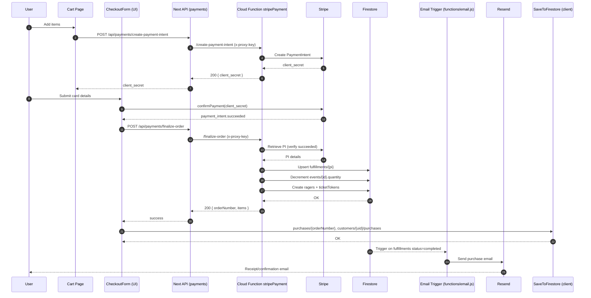

# RAGESTATE User Flows

This document maps key user journeys end-to-end: UI screens → Next API routes → Cloud Functions → Firestore/RTDB/Storage. Use it to trace behavior, debug issues, and onboard quickly.

## Auth & Account

- Create Account: `src/app/create-account/page.js`
  - Uses `createUser` in `lib/utils/auth.js` to create Firebase Auth user, writes to Firestore `customers/{uid}` and RTDB `users/{uid}`.
  - Non-blocking POST `POST /api/payments/create-customer` with `{ uid, email, name }` to map a Stripe customer (via Functions).
  - Sends verification email via `sendEmailVerification` with continue URL `/verify-email`.
- Verify Email: `src/app/verify-email/page.js`, `src/app/verify-email/verify-email.client.js`
  - Handles `mode=verifyEmail&oobCode=...`, reloads auth, and redirects to `/account`.
- Login: `src/app/login/page.js` (selectors and state wired through Redux; not shown here)
  - On success stores `idToken`, `refreshToken`, `email`, `userId` in localStorage.
- Account Hub: `src/app/account/page.js`
  - Tabs: `ProfileTab`, `TicketsTab`, `QrCodeTab`, `OrderHistory`, `SettingsTab`.
  - Loads profile from Firestore via `firebase/util/getUserData.js` with localStorage fallback.
  - QR Code tab renders `userId` using `qrcode.react` in `src/app/account/components/QrCodeTab.js`.

Data paths

- Firestore: `customers/{uid}` primary profile; legacy backup: `users/{uid}`.
- RTDB: `users/{uid}` mirror for admin fallbacks.

## Cart → Payment → Fulfillment

- Cart Page: `src/app/cart/page.js`
  - Computes totals; calls `POST /api/payments/create-payment-intent` with `{ amount, customerEmail, name, firebaseId, cartItems }`.
  - Receives `client_secret`; renders Stripe Elements via `OrderSummaryDisplay` and `components/CheckoutForm.js`.
- Payment Confirmation: `components/CheckoutForm.js`
  - `stripe.confirmPayment({ redirect: 'if_required' })`.
  - On `paymentIntent.status === 'succeeded'` → calls `POST /api/payments/finalize-order` with `{ paymentIntentId, firebaseId, userEmail, userName, cartItems }`.
  - Separately records order client-side via `firebase/util/saveToFirestore.js` under `purchases/{orderNumber}` and `customers/{uid}/purchases/{orderNumber}`.

Next API (proxy) → Functions

- `src/app/api/payments/create-payment-intent/route.js` → `functions/stripe.js` `POST /create-payment-intent`
- `src/app/api/payments/finalize-order/route.js` → `functions/stripe.js` `POST /finalize-order`
- `src/app/api/payments/create-customer/route.js` → `functions/stripe.js` `POST /create-customer`

Cloud Function: `functions/stripe.js`

- `POST /create-payment-intent`
  - Validates amount; creates PI with metadata `{ firebaseId, email, name, cartSize }`.
- `POST /create-customer`
  - Creates or reuses Stripe customer; persists mapping in `customers/{uid}.stripeCustomerId` and RTDB `users/{uid}/stripeCustomerId`.
- `POST /finalize-order`
  - Preconditions: Stripe configured, `x-proxy-key` valid, PI `succeeded`, and (if present) `pi.metadata.firebaseId` matches `firebaseId`.
  - Idempotency: ensures one fulfillment per `paymentIntentId` using `fulfillments/{pi.id}`; returns early if existing.
  - For each `cartItems` entry:
    - Decrements `events/{eventId}.quantity`.
    - Creates `events/{eventId}/ragers/{ragerId}` with `{ ticketQuantity, usedCount: 0, active: true, ticketToken, firebaseId, email, owner, orderNumber, paymentIntentId }`.
    - Writes token map `ticketTokens/{ticketToken}` → `{ eventId, ragerId }`.
  - Updates fulfillment to `status: 'completed'`, sets `orderNumber`, `items`, `email`, `amount`, `currency`.

Data writes

- Firestore: `fulfillments/{paymentIntentId}`; `events/{eventId}` and `events/{eventId}/ragers/*`; `ticketTokens/{token}`.
- Client-side (separate): `purchases/{orderNumber}` and `customers/{uid}/purchases/{orderNumber}` via `SaveToFirestore`.

Email

- Trigger: `functions/email.js:onDocumentWritten('fulfillments/{piId}')`
  - On transition to `status=completed` and if `emailSentAt` not set, resolves recipient from doc or Stripe PI/Customer.
  - Sends transactional email via Resend; annotates fulfillment with `emailSentAt`, `emailProvider`, `email`.

## Ticket Scanning (Admin)

- Admin Scanner UI: `src/app/admin/scanner/page.js`
  - Uses `qr-scanner` to read codes. Accepts tokens in form `rtk:<token>` or `...?tk=<token>`, or a plain Firebase `userId`.
  - Requires env: `NEXT_PUBLIC_PROXY_KEY`, `NEXT_PUBLIC_FUNCTIONS_BASE_URL`.
  - Posts to `{BASE}/scan-ticket` with header `x-proxy-key`.
  - If scanning by `userId`, requires `eventId` selection to avoid broad queries.
  - Success response includes `{ ok, eventId, ragerId, remaining, status }`.

- Cloud Function: `functions/stripe.js` `POST /scan-ticket`
  - Input: `{ token }` (preferred) or `{ userId, eventId }`.
  - Token path: lookup `ticketTokens/{token}` → fetch rager under `events/{eventId}/ragers/{ragerId}`.
  - User path: query `events/{eventId}/ragers` where `firebaseId == userId`; pick an active doc.
  - Transaction: increments `usedCount`, flips `active` when fully used, stamps `lastScanAt` and `lastScannedBy`.
  - Errors: 403 invalid proxy key; 404 mapping not found; 409 wrong event or already used.

Admin utilities

- Backfill: `POST /backfill-ticket-tokens` ensures ragers have `ticketToken`, `usedCount`, `active`, and creates token mappings.
- Test email: `POST /test-send-purchase-email` creates a completed fulfillment to trigger the email flow.

## Social Feed

- Client: `src/app/components/Feed.js`, `Post*` components
  - Public mode lists latest `posts` with pagination and real-time new-post banner.
  - Personalized mode (commented scaffolding) uses `userFeeds/{uid}/feedItems`.
- Functions: `functions/feed.js`
  - onCreate: rate limit posts; fan-out to followers into `userFeeds/{uid}/feedItems/{postId}`; initialize counters.
  - onUpdate: handle visibility toggles; update fanout accordingly.
  - onDelete: cascade delete likes/comments/userFeeds items and Storage files under `posts/{postId}/`.

## Security & Rules (operational guardrails)

- `x-proxy-key` header required by Next API→Functions for payments/scan.
- Do not create `events/{id}/ragers` client-side; only via `finalize-order`.
- Scanning by `userId` must include `eventId`.
- Firestore rules: see `firestore.rules` for posts immutability, admin access, and tickets restrictions.

## Quick References

- Next API: `src/app/api/payments/{create-payment-intent|finalize-order|create-customer}/route.js`
- Functions (HTTP): `functions/stripe.js` → `/create-payment-intent`, `/create-customer`, `/finalize-order`, `/scan-ticket`, `/backfill-ticket-tokens`, `/test-send-purchase-email`
- Email Trigger: `functions/email.js`
- Purchases (client save): `firebase/util/saveToFirestore.js`
- Account Components: `src/app/account/components/*` and `components/OrderHistory.js`

## Sequence Diagrams

### Payment & Fulfillment



### Ticket Scanning

```mermaid
sequenceDiagram
  autonumber
  participant Admin as Admin (door)
  participant Scanner as Scanner Page (UI)
  participant StripeFn as Cloud Function stripePayment
  participant Firestore as Firestore

  Admin->>Scanner: Scan QR (token or userId)
  Scanner->>StripeFn: POST /scan-ticket (x-proxy-key)
  alt Token provided
    StripeFn->>Firestore: Get ticketTokens/{token}
    Firestore-->>StripeFn: { eventId, ragerId }
    StripeFn->>Firestore: Load events/{eventId}/ragers/{ragerId}
  else userId + eventId
    StripeFn->>Firestore: Query events/{eventId}/ragers where firebaseId==userId
    Firestore-->>StripeFn: Active rager doc
  end
  StripeFn->>Firestore: Transaction: increment usedCount; set active=false if fully used
  Firestore-->>StripeFn: remaining
  StripeFn-->>Scanner: { ok, remaining, status }
  Scanner-->>Admin: Show result/toast
  opt Errors
    StripeFn-->>Scanner: 403/404/409 error
    Scanner-->>Admin: Display error state
  end
```

## Troubleshooting Pointers

- PI creation fails: ensure amount ≥ 50 cents; check `PROXY_KEY` wiring and `STRIPE_SECRET` on Functions.
- Finalize returns 409: PI not `succeeded`; retry after confirmation or inspect idempotency doc in `fulfillments/{piId}`.
- No tickets created: confirm `cartItems[].productId` matches `events/{eventId}` IDs; check Function logs for per-item failures.
- Scanner shows wrong-event: verify `eventId` selection when scanning by `userId`.
- Email missing: confirm `RESEND_API_KEY` secret and that fulfillment doc has `status=completed` and an `email` value.
